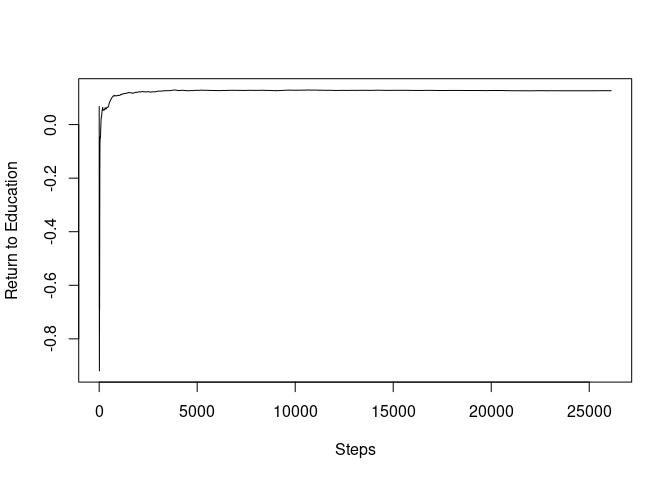
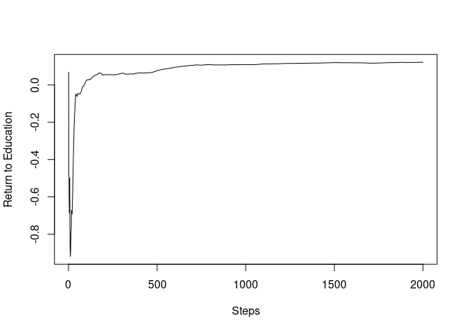

<!-- README.md is generated from README.Rmd. Please edit that file -->

# SGDinference

<!-- badges: start -->

[](https://github.com/SGDinference-Lab/SGDinference/actions)
[](https://codecov.io/gh/SGDinference-Lab/SGDinference)
<!-- badges: end -->

**SGDinference** is an R package that provides estimation and inference
methods for large-scale mean and quantile regression models via
stochastic (sub-)gradient descent (S-subGD) algorithms. The inference
procedure handles cross-sectional data sequentially:

1)  updating the parameter estimate with each incoming “new
    observation”,
2)  aggregating it as a Polyak-Ruppert average, and
3)  computing an asymptotically pivotal statistic for inference through
    random scaling.

The methodology used in the SGDinference package is described in detail
in the following papers:

- Lee, S., Liao, Y., Seo, M.H. and Shin, Y., 2022. Fast and robust
  online inference with stochastic gradient descent via random scaling.
  In *Proceedings of the AAAI Conference on Artificial Intelligence*
  (Vol. 36, No. 7, pp. 7381-7389).
  <https://doi.org/10.1609/aaai.v36i7.20701>.

- Lee, S., Liao, Y., Seo, M.H. and Shin, Y., 2023. Fast Inference for
  Quantile Regression with Tens of Millions of Observations.
  arXiv:2209.14502 \[econ.EM\]
  <https://doi.org/10.48550/arXiv.2209.14502>.

## Installation

You can install the development version from
[GitHub](https://github.com/) with:

``` r
# install.packages("devtools") # if you have not installed "devtools" package
devtools::install_github("SGDinference-Lab/SGDinference")
```

We begin by calling the SGDinference package.

``` r
library(SGDinference)
```

## Case Study: Estimating the Mincer Equation

To illustrate the usefulness of the package, we use a small dataset
included in the package. Specifically, the *Census2000* dataset from
Acemoglu and Autor (2011) consists of observations on 26,120 nonwhite,
female workers. This small dataset is constructed from
“microwage2000_ext.dta” at
<https://economics.mit.edu/people/faculty/david-h-autor/data-archive>.
Observations are dropped if hourly wages are missing or years of
education are smaller than 6. Then, a 5 percent random sample is drawn
to make the dataset small. The following three variables are included:

- ln_hrwage: log hourly wages
- edyrs: years of education
- exp: years of potential experience

We now define the variables.

``` r
    y = Census2000$ln_hrwage 
  edu = Census2000$edyrs
  exp = Census2000$exp
 exp2 = exp^2/100
```

As a benchmark, we first estimate the Mincer equation and report the
point estimates and their 95% heteroskedasticity-robust confidence
intervals.

``` r
mincer = lm(y ~ edu + exp + exp2)
inference = lmtest::coefci(mincer, df = Inf,
                             vcov = sandwich::vcovHC)
results = cbind(mincer$coefficients,inference)
colnames(results)[1] = "estimate"
print(results)
#>                estimate       2.5 %      97.5 %
#> (Intercept)  0.58114741  0.52705757  0.63523726
#> edu          0.12710477  0.12329983  0.13090971
#> exp          0.03108721  0.02877637  0.03339806
#> exp2        -0.04498841 -0.05070846 -0.03926835
```

### Estimating the Mean Regression Model Using SGD

We now estimate the same model using SGD.

``` r
 mincer_sgd = sgdi_lm(y ~ edu + exp + exp2)
 print(mincer_sgd)
#> Call: 
#> sgdi_lm(formula = y ~ edu + exp + exp2)
#> 
#> Coefficients: 
#>             Coefficient    CI.Lower    CI.Upper
#> (Intercept)  0.58692678  0.51821551  0.65563805
#> edu          0.12652414  0.12289664  0.13015163
#> exp          0.03153344  0.02785877  0.03520811
#> exp2        -0.04603275 -0.05576062 -0.03630488
#> 
#> Significance Level: 95 %
```

It can be seen that the estimation results are similar between two
methods. There is a different command that only computes the estimates
but not confidence intervals.

``` r
 mincer_sgd = sgd_lm(y ~ edu + exp + exp2)
 print(mincer_sgd)
#> Call: 
#> sgd_lm(formula = y ~ edu + exp + exp2)
#> 
#> Coefficients: 
#>             Coefficient
#> (Intercept)  0.58400539
#> edu          0.12674866
#> exp          0.03151793
#> exp2        -0.04593379
```

We compare the execution times between two versions and find that there
is not much difference in this simple example. By construction, it takes
more time to conduct inference via `sgdi_lm`.

``` r
library(microbenchmark)
res <- microbenchmark(sgd_lm(y ~ edu + exp + exp2),
                      sgdi_lm(y ~ edu + exp + exp2),
                      times=100L)
#> Warning in microbenchmark(sgd_lm(y ~ edu + exp + exp2), sgdi_lm(y ~ edu + :
#> less accurate nanosecond times to avoid potential integer overflows
print(res)
#> Unit: milliseconds
#>                           expr      min       lq     mean   median       uq
#>   sgd_lm(y ~ edu + exp + exp2) 3.425058 3.784853 4.319049 3.893012 4.167773
#>  sgdi_lm(y ~ edu + exp + exp2) 4.163099 4.520229 5.106551 4.622975 4.875515
#>        max neval
#>   8.647433   100
#>  11.408947   100
```

To plot the SGD path, we first construct a SGD path for the return to
education coefficients.

``` r
mincer_sgd_path = sgdi_lm(y ~ edu + exp + exp2, path = TRUE, path_index = 2)
```

Then, we can plot the SGD path.

``` r
plot(mincer_sgd_path$path_coefficients, ylab="Return to Education", xlab="Steps", type="l")
```



To observe the initial paths, we now truncate the paths up to 2,000.

``` r
plot(mincer_sgd_path$path_coefficients[1:2000], ylab="Return to Education", xlab="Steps", type="l")
```



``` r
print(c("2000th step", mincer_sgd_path$path_coefficients[2000]))
#> [1] "2000th step"       "0.123913138474636"
print(c("Final Estimate", mincer_sgd_path$coefficients[2]))
#> [1] "Final Estimate"    "0.126641059670094"
```

It can be seen that the SGD path almost converged only after the 2,000
steps, less than 10% of the sample size.

## What else the package can do

See the vignette for the quantile regression example.

# References

Acemoglu, D. and Autor, D., 2011. Skills, tasks and technologies:
Implications for employment and earnings. In *Handbook of labor
economics* (Vol. 4, pp. 1043-1171). Elsevier.

Lee, S., Liao, Y., Seo, M.H. and Shin, Y., 2022. Fast and robust online
inference with stochastic gradient descent via random scaling. In
*Proceedings of the AAAI Conference on Artificial Intelligence* (Vol.
36, No. 7, pp. 7381-7389). <https://doi.org/10.1609/aaai.v36i7.20701>.

Lee, S., Liao, Y., Seo, M.H. and Shin, Y., 2023. Fast Inference for
Quantile Regression with Tens of Millions of Observations.
arXiv:2209.14502 \[econ.EM\]
<https://doi.org/10.48550/arXiv.2209.14502>.
